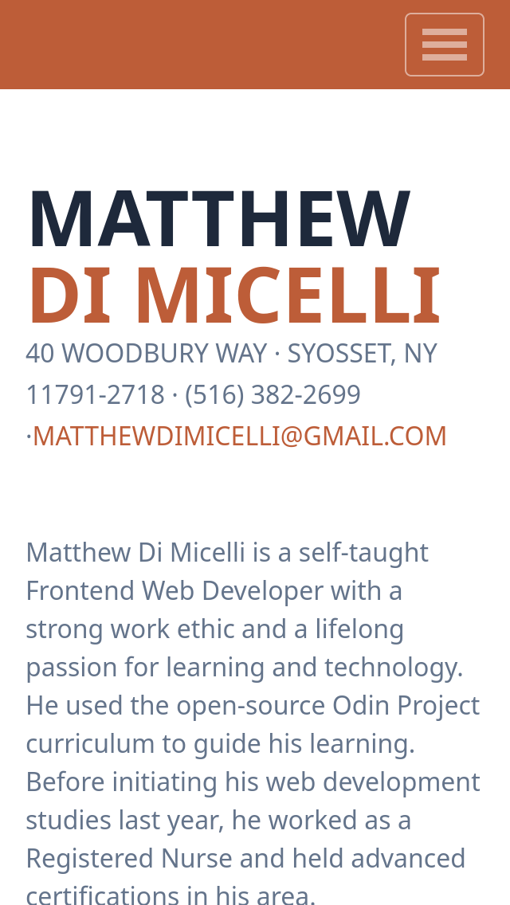

# Readme
# Personal Website

## Overview

My personal website.  The design was heavily inspired by Clarence Taylor's person
website which can be found [here](https://technext.github.io/resume-bootstrap4/),
however my implementation is 100% original.  

### Screenshot

  

### Links

- [Live site](https://mattdimicelli.github.io/personal_website/)
- [Repo](https://github.com/mattdimicelli/personal_website)

## My process

### Built with

- React (functional components utilizing hooks)
- Tailwind CSS
- gh-pages (to assist with pushing the app to Github Pages)
- react-scrolls, for smooth scrolling feature
- react-icons, to provide a standardized API to manipulate and utilize icons
  from different sources
- a personally and custom-made "Spanish" icon
- Intersection-Observer API
- A mobile-first, responsive design

### What I learned

It was fun building out the responsive sidebar/drop-down menu using CSS.  

I learned that when using the Intersection-Observer API there are distinct
approaches: to use one observer to keep track of multiple elements, or to match
a single element with it's own observer.  I chose to combine these techniques in
order to avoid the callback from being called on two elements at the same time.

Although I found icons for almost everything that I wanted, I couldn't find an
icon to represent the Spanish language.  So, I decided to build my own, and as 
part of that process I figured out how I could simulate a :hover state using
React state and mouse events.